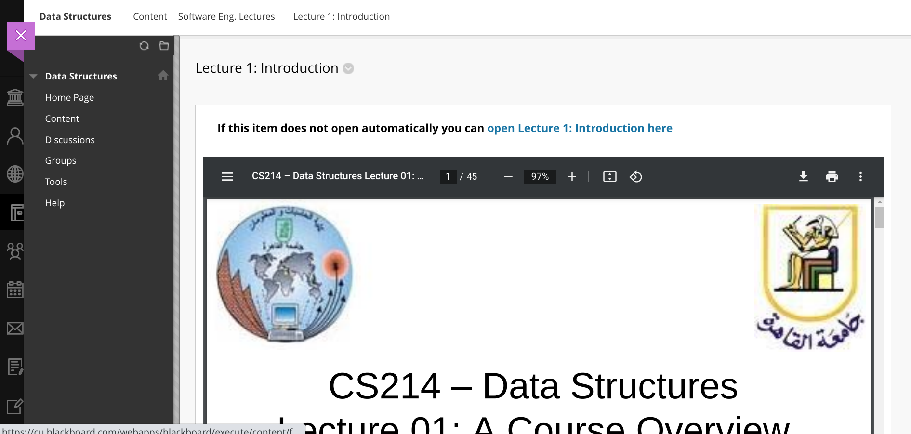
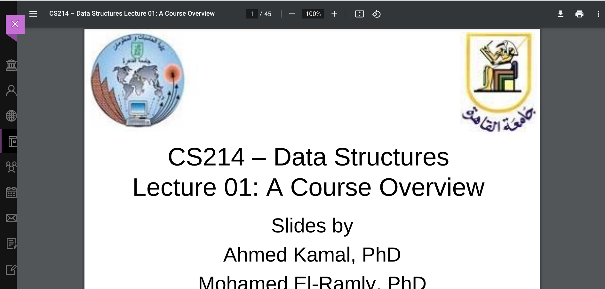

# Faster BlackBoard

A chrome extension that skips the intermediate page that BlackBoard shows when opening PDFs

### Before

### After

You can also open the PDF in a new tab if you don't want to open it in the embedded BlackBoard frame.
